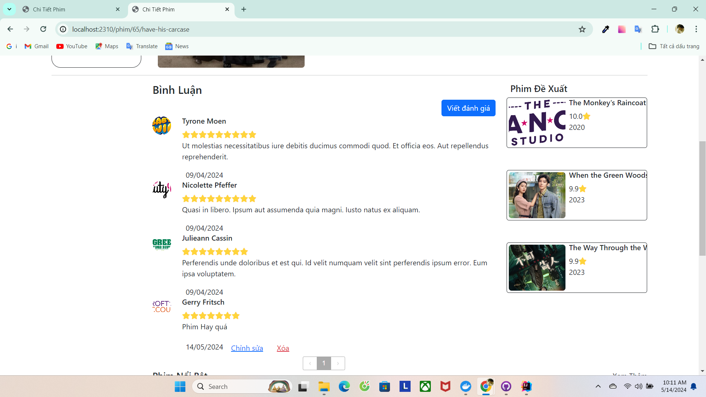

# Movie App

##  Project Description
In today's digital age, watching movies online has become an indispensable part of our entertainment life. The online movie viewing system project uses Spring Boot, Thymeleaf, Spring Security, Hibernate and MySQL, providing a smooth and diverse movie viewing experience for users.
##  Basic Function For User
1. **Login/Sign up**:

2. **Home Page**
   - 
4. **Movie Search**:
     - Users can search for movies by many criteria such as genre, country, series, retail movies, and theatrical movies. Search results are organized scientifically, making it easy for viewers to choose.
5. **View Movie Information**:
     - Information of the movie.
     - List of episodes (if any).
       
     - Review of the movie.
     - List of recommended movies.
         
6. **Watch movies**:
  
7. **Review** :
     - Users can leave reviews and comments about the movies they have watched, helping the community have more information to refer to before watching the movie.
        
8. **Logout**:
   - This function helps users ensure that their accounts are not accessed without permission, protecting personal information and movie viewing history.
##  Basic Function For Admin
1. **View System Overview**:
    - Administrators can view an overview dashboard, providing a comprehensive view of important system metrics such as number of new registered users, number of most viewed movies, revenue from movie sales , and      more. This helps administrators grasp the operational situation and make strategic decisions.
2. **User management**:
    - Administrators can view user lists, edit user information, or lock/unlock user accounts if necessary. This helps ensure a healthy and safe environment for the viewing community.
3. **Managing Movies, Episodes**:
    - This function allows administrators to add, edit or delete movies and episodes. Administrators can update movie information, manage movie status (eg: premiere, currently running, ended), and manage the           content of each episode.
4. **Managing Actors, Directors, Movie Genres, Countries**:
    - Administrators can manage detailed information about actors, directors, add or edit movie genres, and movie production countries. This helps users easily search and choose movies according to their                preferences.
5. **Blog management**:
   - This function allows administrators to post, edit or delete articles about movie news, movie reviews or user guide articles. This is an effective way to interact and retain users on the system.

